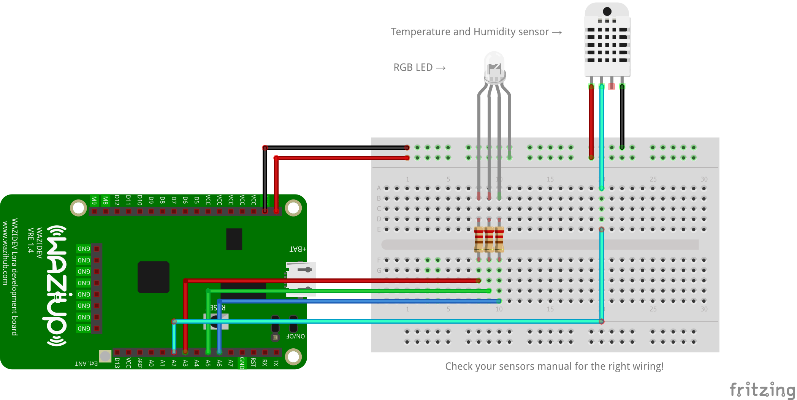

# WaziDev Example

This Arduino sketch features the following devices and libraries:

Libraries:

- [WaziDev with LoRaWAN](https://github.com/Waziup/wazidev-lib) (uplink and downlink)
- [XLPP Payload](https://github.com/Waziup/arduino-xlpp) (encryption and decryption)
- [DHT sensor library](https://www.arduino.cc/reference/en/libraries/dht-sensor-library/)

❗ Please install the DHT sensor library using the Arduino Library Manager ❗

Sensors:

- DHT temperature and humidity sensor

Actuators:

- RGB-LED (three-color LED)

## Wiring

Check you wiring!

Some RGB-LEDs want to be connected to `GND`, others to `5V` or `3.3V`. Check the documentation for your RGB-LED. If you don't have a 3-colored LED, you can use 3 individual LEDs, preferably red, green and blue.

